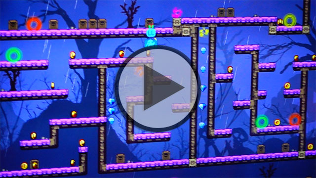
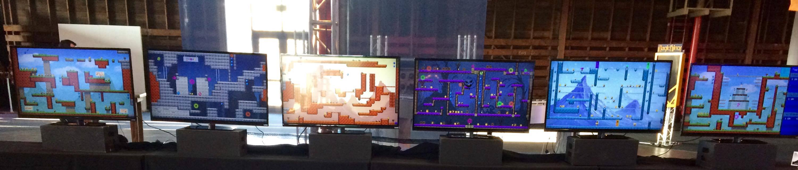
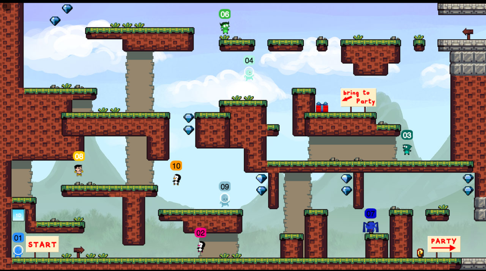
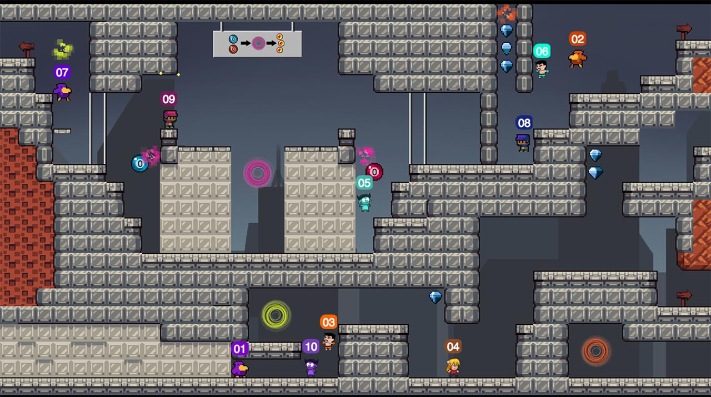
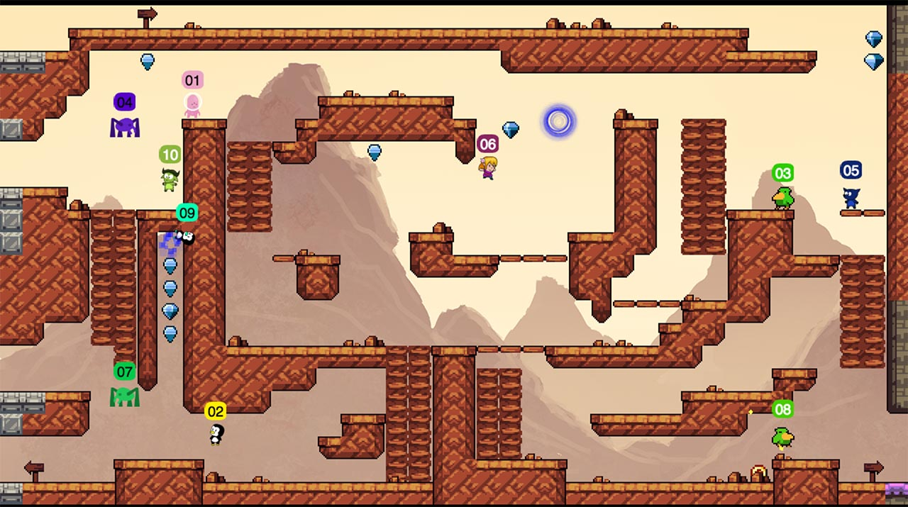
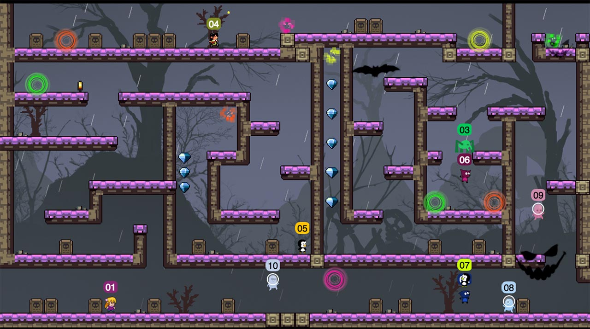
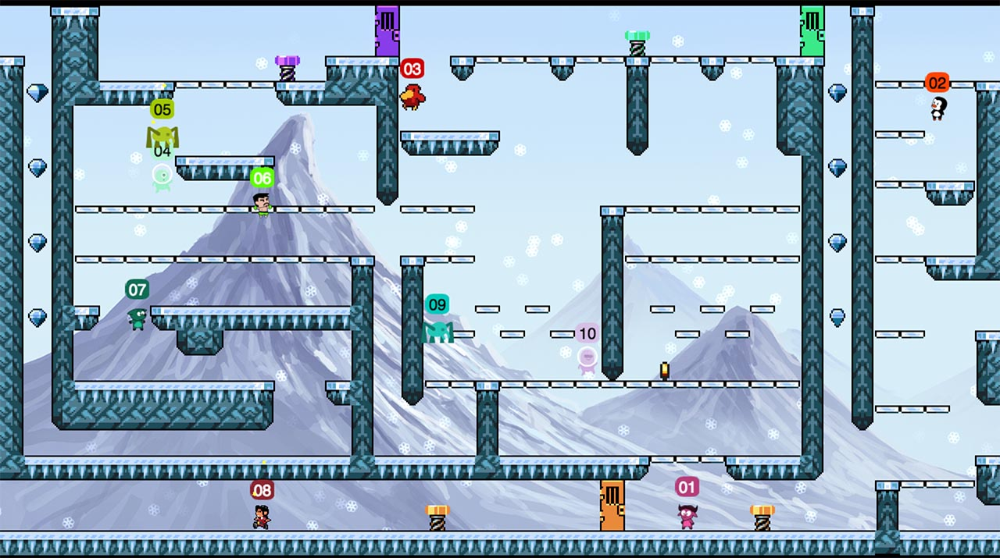
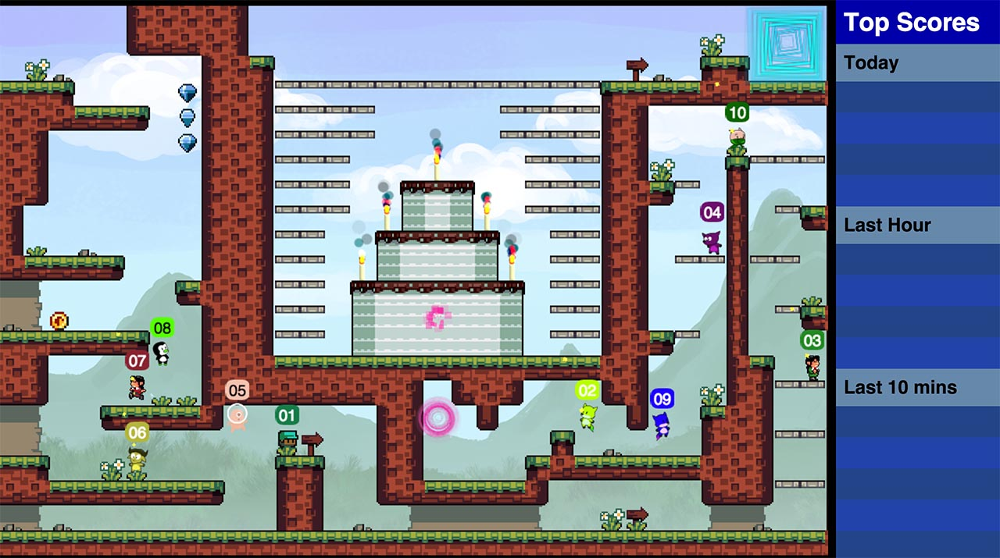

飛んで行こ！(Tonde-Iko!)
======================

This is a 50 player 6 screen platformer. Players
connect to the WiFi and use their smartphone to
control a player. They then start at the left
most screen and can move their characters
across all 6 screens.

 

Made with [HappyFunTimes](http://greggman.github.io/HappyFunTimes)

The 6 levels below were created for the [Steam Carnival](http://steamcarnival.com)

Making Levels
-------

See [Making Levels](making.md).

Note: The code is currently hardcoded to 6 levels across. That is an artifical limit. It would be trival (as in minutes of work) to support
any number of screens in any arrangement. Instead of

    ▆ ▆ ▆ ▆ ▆ ▆

How about

                ▆ ▆ ▆   ▆ ▆ ▆
        ▆ ▆ ▆   ▆   ▆ ▆ ▆   ▆ ▆ ▆
    ▆ ▆ ▆   ▆ ▆ ▆       ▆ ▆ ▆

With a little more work diagonal screens could also be supported.

Cloning
-------

[If you want to clone this follow the instructions here](https://github.com/greggman/HappyFunTimes/blob/master/docs/makinggames.md)

Attribution
-----------

See [Attribution](attribution.md)

