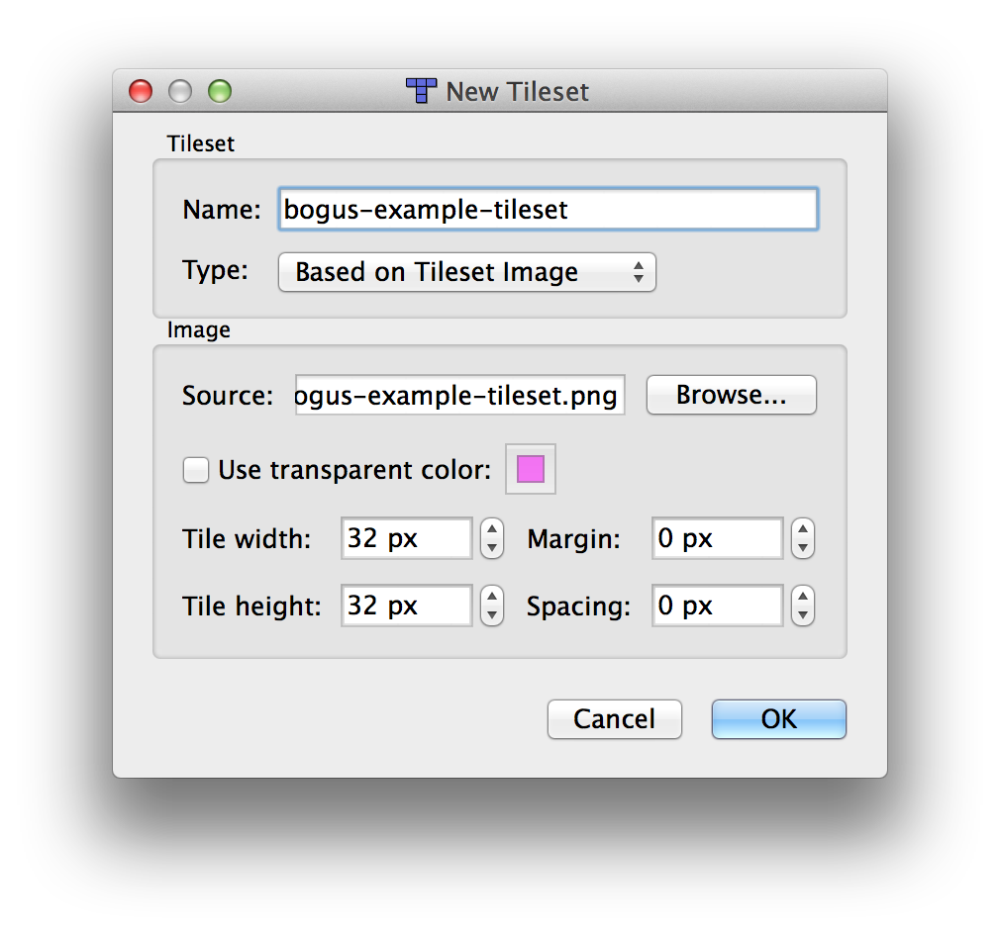
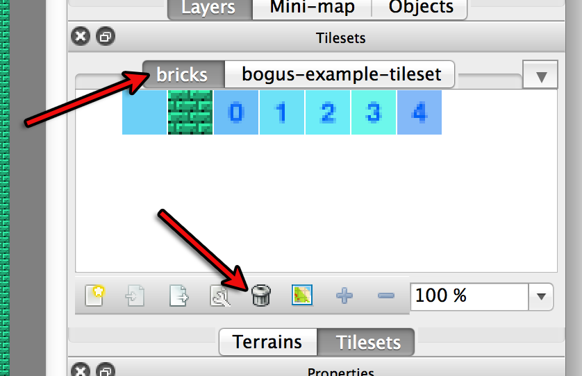
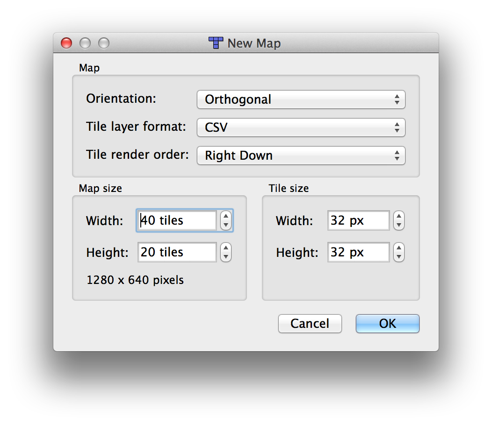
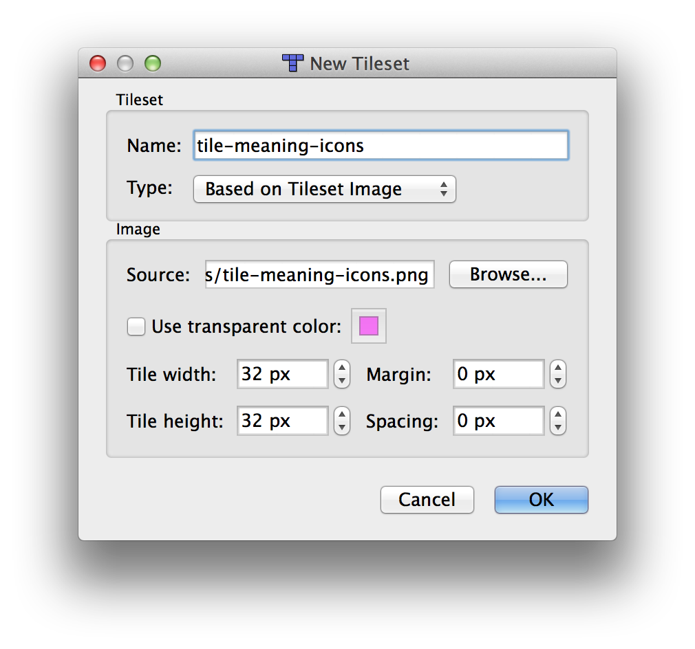
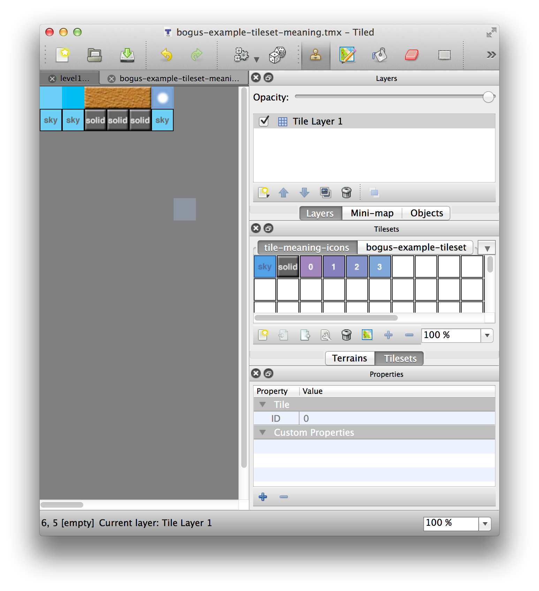

Making Levels
=============

I've forced this to be 6 screens, 1920x1080. With 32x32 pixel tiles that's 60x33 tiles per screen.

I've made 1 map for each screen, they are stored in

    assets/level0-0.json
    assets/level1-0.json
    assets/level2-0.json
    assets/level3-0.json
    assets/level4-0.json
    assets/level5-0.json

## Making a new Tileset

To make a new tileset create a PNG file that is some multiple of 32x32. Run Tiled, load the map
you want to change the tileset on.

*   Pick Map->New Tileset, pick your png. Note: your PNG **MUST BE IN THE ASSETS FOLDER**.

    

*   To delete an old tileset. Select the old tileset (probably "bricks") and click the trashcan

    

    Note: You can have multiple tilesets.

## Assign Meanings to tiles

I chose a 1x1 meaning system meaning each visual tile is allowed only 1 specific meaning.
To assign these meanings

1.  make new map in tiled.

    

2.  Then load the `tile-meaning-icons.png` as a tileset

    

3.  Next load your tileset png as a tileset

    

4.  Place your tiles in even rows (where the top row is row 0) and place
    meaning tiles on the row under them to give them a meaning

    

    In the picture above you should be able to see the first 2 tiles are
    assigned a "sky" meaning. The next 3 tiles are assigned a "solid* meaning
    and last tile is assigned a "sky" meaning

5.  Save the file with the same name as your tileset png except change the end
    to "-meaning". In other words, if you had png called `my-tiles.png` you'd
    have a corresponding `my-tiles-meaning.json` file beside it.

Note: You are not required to have a `-meaning.json` file. If no file exists all the tiles will have meaning #0 (sky).

## Multiple Layers

You can have multiple layers. The first layer named either "Tile Layer 1" or starting with
the letters "play" is the **playable layer**. It is the only layer in which tiles have a meaning.
Layers behind that layer will be be drawn behind, layers in front of that layer will be draw in front.
Be aware that each layer has a cost. Too many layers can ruin performance. I'd prefer to keep it at
3 layers, one behind, one the player is on, one in front.

